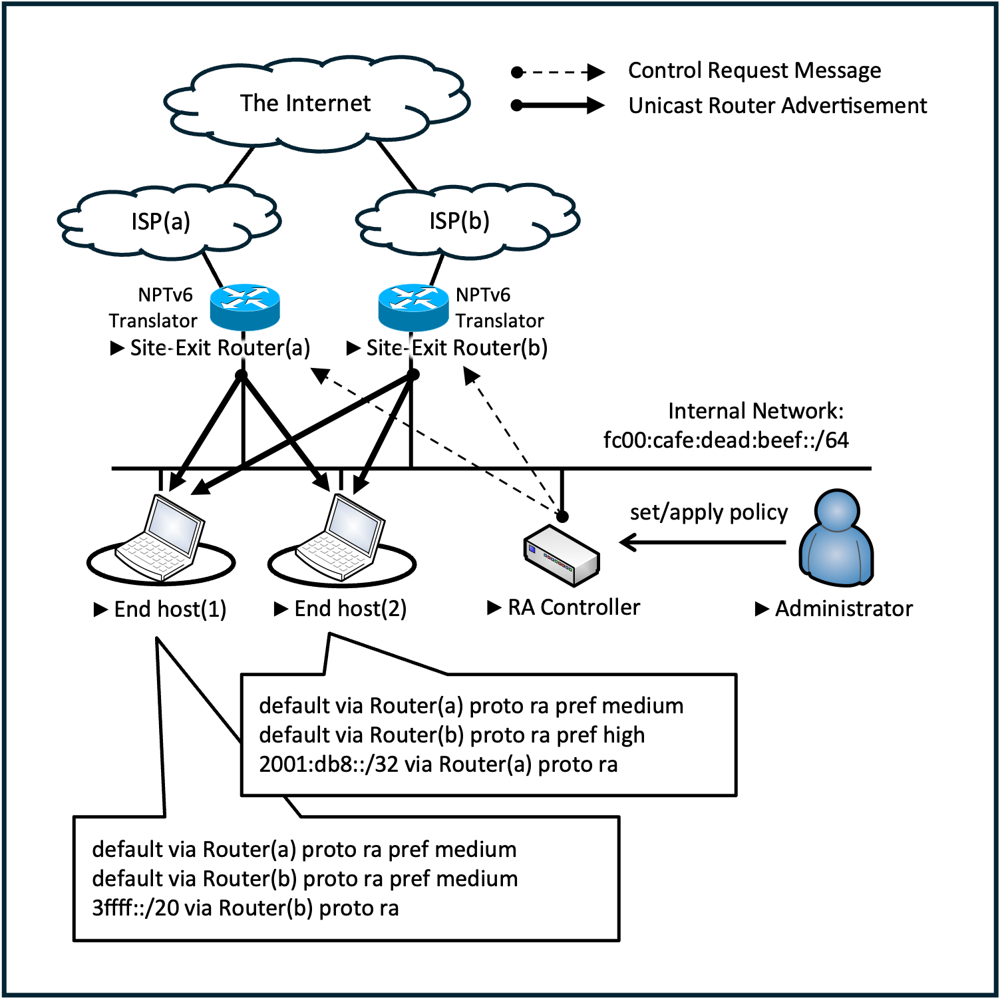

# Polaris

A Host-Based Policy Routing Framework for IPv6 Site Multihoming
without End Host Modifications.

Polaris enables a network administrator to direct traffic from individual
hosts (or host groups) to specific upstream ISPs in an IPv6 site multihoming
environment **without touching the end-host configuration**.  It does so by
combining [NPTv6](https://www.rfc-editor.org/rfc/rfc6296) with **dynamically
controlled unicast Router Advertisements** (RFC 4191).

[English](README.md) / [日本語](README_ja.md)

## Why Polaris?

In conventional IPv6 site multihoming, the upstream ISP is determined by
**source-address selection** at the end host.

Polaris **shifts ISP selection from source-address selection to first-hop
router selection**.  All hosts share a single IPv6 prefix (translated by
NPTv6 at each site-exit router), and the framework controls *which*
site-exit router each host uses by sending **per-host unicast RAs** with
appropriate DRP/RIO values.

> DRP: Default Router Preference
> RIO: Route Information Option

## Architecture



The administrator defines policies via the RA Controller's web UI.  The
controller compiles each policy into a per-router gRPC `InterfaceConfig`
and pushes it to the corresponding `gora` daemon.  `gora` then transmits
unicast RAs to the targeted hosts, modifying their default gateway
(`DRP=high`) or installing route information (`RIO`).

## Repository layout

| Path | Role |
|------|------|
| [`agent/`](agent/) | Site-exit router agent (`gora` daemon, NPTv6 setup, systemd unit) |
| [`agent/go-ra/`](agent/go-ra/) | go-ra source — git submodule, forked from [YutaroHayakawa/go-ra](https://github.com/YutaroHayakawa/go-ra) |
| [`controller/`](controller/) | RA Controller — Go backend, React/Vite frontend, neighbor & endpoint collector modules |
| [`laboratory/`](laboratory/) | Self-contained Docker Compose lab (3 routers, 10 hosts, controller, web server) |

Each subdirectory has its own README — see those for build & deployment
details.

## Three ways to run Polaris

### 1. Docker lab

A complete reproducible environment with three routers, ten hosts, the
controller, and an upstream web server.

```bash
git clone --recurse-submodules <this-repo>
cd polaris
docker compose -f laboratory/docker-compose.yaml up --build
# open http://localhost:3000
```

See [`laboratory/README.md`](laboratory/README.md) for the demo workflow,
verification scripts, and Docker-specific caveats.

### 2. Standalone controller (for testing against real routers)

Run the controller as a regular process (or systemd unit) on a management
host, with `gora` agents already deployed on your routers.

```bash
cd controller
./server.sh                 # dev mode (frontend on :5173, backend on :8080)
```

See [`controller/README.md`](controller/README.md) for systemd deployment,
parameter file format, and module configuration.

### 3. Production agent (per router)

Deploy the agent on each site-exit router — configures NPTv6, NDP proxy,
sysctls, and installs `gora` as a systemd service.

```bash
cd agent
git submodule update --init
sudo WAN_PREFIX=2001:db8:wan::/64  \
     LAN_PREFIX=fc00:cafe::/64     \
     WAN_IF=eth0  ./setup.sh
```

See [`agent/README.md`](agent/README.md) for the operational guide.

## Key concepts

| Term | Meaning |
|------|---------|
| **Rule** | A mapping `(destination prefixes) → (site-exit router)` |
| **Group** | A named set of host link-local addresses |
| **Policy** | A group ↔ rules association — applied to all member hosts |
| **DRP** | Default Router Preference (RFC 4191) — `high` makes a router the preferred default gateway |
| **RIO** | Route Information Option (RFC 4191) — installs a specific-prefix route |
| **NPTv6** | One-to-one prefix translation (RFC 6296) — preserves host privacy and avoids ingress filtering |

### Policy-to-RA compilation

For each policy that targets a router *n*, the controller emits one
`InterfaceConfig` per rule:

- If a destination set contains `::/0` → set `preference = high` (DRP),
  making *n* the preferred default gateway for the targeted clients.
- Otherwise → emit each prefix as a `RIO` with `preference = medium`,
  installing a specific-prefix route via *n*.
- The RA is sent as a **unicast** to every host in the group.

The implementation lives in
[`controller/backend/internal/engine/engine.go`](controller/backend/internal/engine/engine.go).
