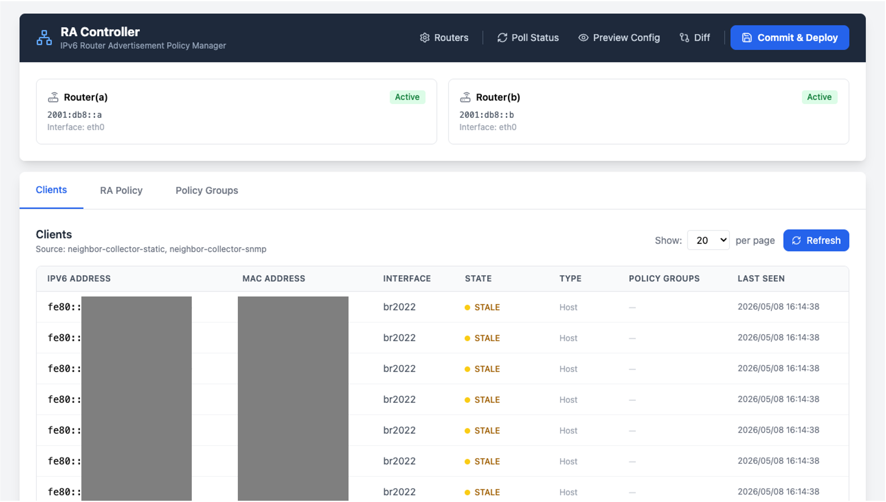
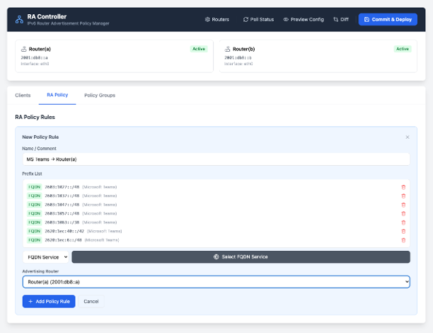
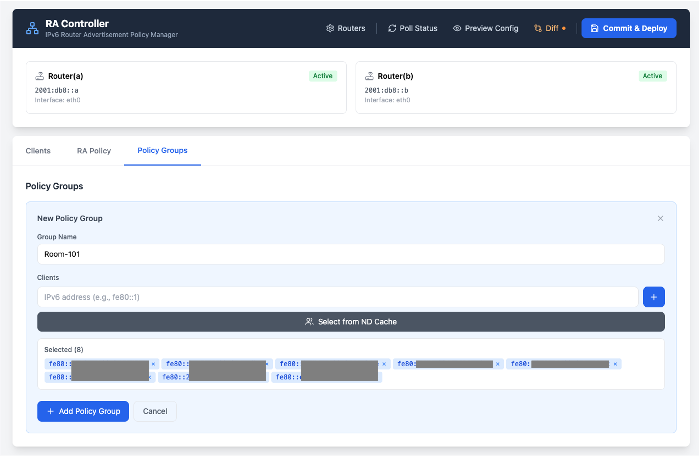
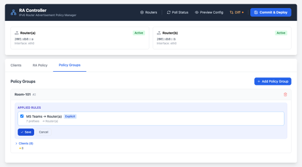
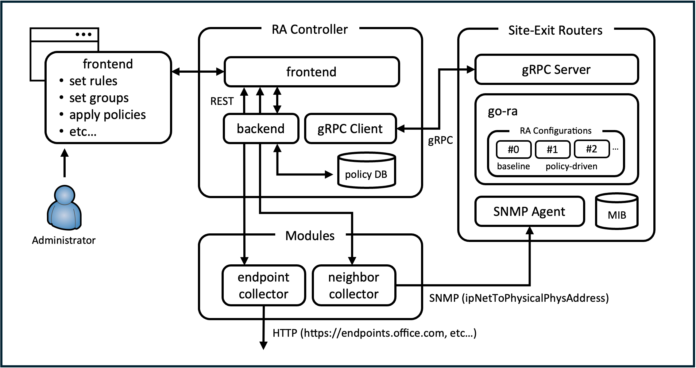

# RA Controller

IPv6 ルータ広告デーモン [go-ra (fork版)](https://github.com/y-kzm/go-ra) を管理するための Web UI + バックエンドです。
ブラウザからルータの設定・ルーティングルール・ホストグループを管理し、ポリシーを各ルータ上の go-ra エージェントへ gRPC で一括適用できます。

## スクリーンショット

| クライアント一覧 | RA ポリシールール |
|----------------|----------------|
|  |  |

| ポリシーグループ作成 | ルール割り当て |
|-------------------|-------------|
|  |  |

## アーキテクチャ



### コンポーネント

| ディレクトリ | 役割 |
|-------------|------|
| `backend/` | Go HTTP サーバ。設定を SQLite に保存し、ポリシーをルータへ push する |
| `frontend/` | Vite + React + TypeScript の管理 UI |
| `modules/neighbor-collector-snmp/` | SNMP でルータから IPv6 ネイバーを収集する |
| `modules/neighbor-collector-static/` | 静的なネイバーリストを返す |
| `modules/endpoint-collector-static/` | 静的な FQDN/IP エンドポイントリストを返す |
| `modules/endpoint-collector-ms365/` | Microsoft API から Microsoft 365 のエンドポイントを取得する |

### 主要な概念

- **Router（ルータ）**: go-ra エージェントが動作するネットワーク機器。RA パラメータを設定する。
- **Rule（ルール）**: 特定のネクストホップルータに対して広告すべき IPv6 プレフィックス / FQDN のセットを定義する。
- **Group（グループ）**: クライアントホストの名前付きセット。グループにルールを紐付けることで、どのクライアントがどのルートを受け取るかを制御する。
- **Neighbor（ネイバー）**: ネットワーク上で発見された IPv6 ホスト。グループメンバーシップの情報源となる。

## REST API 概要

`/api` 配下にマウントされています:

| メソッド | パス | 説明 |
|--------|------|------|
| GET    | `/routers` | 登録済みルータ一覧 |
| POST   | `/routers` | ルータの登録（`gora` 自己登録時にも使用）|
| GET    | `/routers/status` | 全ルータの到達性 + TX カウンタ（並列 gRPC `GetStatus`）|
| GET    | `/routers/{id}/status` | 単一ルータの到達性 |
| GET    | `/routers/{id}/interfaces` | 単一ルータで動作中の `InterfaceConfig` 一覧（gRPC `ListInterfaces`）|
| PUT    | `/routers/{id}` | ルータ設定の更新 |
| DELETE | `/routers/{id}` | ルータの削除 |
| GET    | `/rules` | ルール一覧 |
| POST   | `/rules` | ルール作成（`{nexthop, entries: [{value: <prefix>}]}`）|
| DELETE | `/rules/{id}` | ルール削除 |
| GET    | `/groups` | グループ一覧 |
| POST   | `/groups` | グループ作成（`{name, members: [<link-local>...]}`）|
| PUT    | `/groups/{id}/rules` | ルール割り当ての置換（`{rules: [<id>...]}`）|
| DELETE | `/groups/{id}` | グループ削除 |
| GET    | `/neighbors` | 検出されたネイバー一覧 |
| POST   | `/neighbors/refresh` | 全 collector の即時ポーリングを強制 |
| GET    | `/neighbor-sources` | 設定済み collector のソースラベル一覧 |
| POST   | `/policy/apply` | ルール × グループをコンパイルし各ルータへ gRPC push |
| GET    | `/fqdn/services` | endpoint-collector のサービス一覧（FQDN ベースのルール用）|
| GET    | `/fqdn/services/{name}/endpoints` | サービス名から IP プレフィクスを解決 |

## クイックスタート

```bash
# 全コンポーネントを起動（バックエンド + 有効なモジュール + フロントエンド開発サーバ）
./server.sh
```

フロントエンドの開発サーバはデフォルトで `http://localhost:5173` で起動します。

## 設定

すべての設定は `param.yaml` で管理します：

```yaml
backend:
  port: 8080
  db_path: controller.db
  fetch_interval: 10        # ネイバーポーリング間隔（秒）
  neighbor_ifname: ""       # インタフェース名でフィルタ（空 = 全インタフェース）

modules:
  neighbor_collector_static:
    enabled: true
    port: 8083
    neighbors: []           # 静的ネイバーのリスト

  neighbor_collector_snmp:
    enabled: true
    port: 8084
    poll_interval: 30
    snmp_targets:               # ルータ1台につき1エントリ; port/community は省略可
      - host: "router1.example.com"
        port: 161
        community: "public"
      - host: "router2.example.com"
        port: 161
        community: "private"

  endpoint_collector_static:
    enabled: true
    port: 8082
    services: []            # 静的サービスのリスト

  endpoint_collector_ms365:
    enabled: true
    port: 8085
    db_path: ./m365_endpoints.db
    instance: Worldwide     # Worldwide | China | USGovDoD | USGovGCCHigh
```

#### プロジェクト構成

```
frontend/src/
  types.ts                    共有 TypeScript インターフェース
  utils/
    api.ts                    getApiUrl() — VITE_API_URL からバックエンド URL を解決
    format.ts                 formatDateTime() / neighborLedStatus() ヘルパー
    yaml.ts                   ポリシー YAML 生成と LCS ベースの差分計算
  providers/
    neighbor-rest.ts          /api/neighbors 用 REST クライアント
    service-rest.ts           /api/fqdn/services 用 REST クライアント
  components/
    RouterGrid.tsx            ルーターステータスカード（インターフェース名がクリック可能）
    NeighborsTab.tsx          Clients タブ（ページネーション付きネイバーテーブル、source router を表示）
    RulesTab.tsx              RA Policy タブ
    GroupsTab.tsx             Policy Groups タブ
    StatusLed.tsx             接続状態インジケータ
    NotificationStack.tsx     トースト通知オーバーレイ
    modals/
      ConfirmModal.tsx        汎用確認ダイアログ
      FqdnModal.tsx           FQDN サービス選択モーダル
      NeighborModal.tsx       Shift クリック範囲選択付きネイバー選択モーダル
      RouterConfigModal.tsx   ルーター追加・編集・削除フォームモーダル
      RAInterfaceModal.tsx    動作中の RA InterfaceConfig 表示（PIO/RIO/Clients/DRP）
      YamlPreviewModal.tsx    ポリシー YAML・radvd 設定プレビューモーダル
      YamlDiffModal.tsx       最後に適用したポリシーとの差分表示モーダル
  App.tsx                     状態管理、API 呼び出し、レイアウト
  main.tsx                    アプリケーションのエントリーポイント
```

## ネイバーリフレッシュ

Clients タブの **Refresh** ボタンはキャッシュを読むだけでなく、エンドツーエンドのポーリングを行います：

1. バックエンドが全コレクタへ `POST /api/neighbors/refresh` を**並列**で送信
2. 各コレクタが即時 SNMP ウォークを実行
3. バックエンドが更新済みの結果を取得して DB に書き込み
4. UI に最新データを反映

SNMP フラッディングを防ぐため、リフレッシュ後 10 秒間はボタンを無効化します。

バックグラウンドポーリング（`fetch_interval` / `poll_interval`）は独立して継続します。

## systemd デプロイ

### 前提条件

- systemd を使用する Linux
- Go（初回起動時のバイナリビルドに必要）
- Python 3 + PyYAML（`pip3 install pyyaml`）

### インストール手順

**1. 専用システムユーザの作成**

```bash
sudo useradd -r -s /sbin/nologin -d /opt/ra-controller ra-controller
```

**2. アプリケーションのデプロイ**

```bash
sudo cp -r /path/to/ra-controller /opt/ra-controller
sudo chown -R ra-controller:ra-controller /opt/ra-controller
sudo chmod +x /opt/ra-controller/server.sh
```

**3. param.yaml の編集**

```bash
sudo -u ra-controller nano /opt/ra-controller/param.yaml
```

`snmp_targets` やポート番号など、環境に合わせた設定を行います。

**4. （省略可）環境変数オーバーライドファイルの作成**

```bash
sudo mkdir -p /etc/ra-controller
sudo cp /opt/ra-controller/systemd/env.example /etc/ra-controller/env
sudo nano /etc/ra-controller/env
```

`param.yaml` のデフォルト値と異なる値をアンコメントして設定します。

**5. （省略可）ログディレクトリの準備**

journald に加えてファイルへのログ出力が必要な場合のみ設定します。

```bash
sudo mkdir -p /var/log/ra-controller
sudo chown ra-controller:ra-controller /var/log/ra-controller
```

その後、`/etc/ra-controller/env` に `LOG_DIR=/var/log/ra-controller` を設定します。

**6. サービスのインストールと起動**

```bash
sudo cp /opt/ra-controller/systemd/ra-controller.service /etc/systemd/system/
sudo systemctl daemon-reload
sudo systemctl enable --now ra-controller
```

### 日常的な操作

```bash
# 状態確認
sudo systemctl status ra-controller

# 起動 / 停止 / 再起動
sudo systemctl start   ra-controller
sudo systemctl stop    ra-controller
sudo systemctl restart ra-controller

# ライブログストリーム
sudo journalctl -u ra-controller -f

# 最後の起動以降のログ
sudo journalctl -u ra-controller -b

# コンポーネントでフィルタ（括弧内のラベルで grep）
sudo journalctl -u ra-controller -g '\[backend\]'
sudo journalctl -u ra-controller -g '\[neighbor_collector_snmp\]'

# 最新 100 行
sudo journalctl -u ra-controller -n 100
```

### アップデート

```bash
# 1. 新しいファイルをデプロイ
sudo rsync -a --chown=ra-controller:ra-controller /path/to/new-version/ /opt/ra-controller/

# 2. サービスを再起動（server.sh が起動時に Go バイナリを再ビルドする）
sudo systemctl restart ra-controller
```

### インストールパスの変更

サービスファイルはデフォルトで `/opt/ra-controller` を使用します。別のパスに変更する場合は、インストール前にサービスファイルを編集します：

```bash
sudo sed -i 's|/opt/ra-controller|/your/path|g' \
  /opt/ra-controller/systemd/ra-controller.service
```

### ログフォーマット

各コンポーネントの出力行は、タイムスタンプとブラケット付きコンポーネント名でプレフィックスされます：

```
YYYY-MM-DD HH:MM:SS [component-name] original log message
```

例：

```
2026-05-08 15:32:01 [backend] starting go-ra client backend server on port 8080
2026-05-08 15:32:04 [neighbor_collector_snmp] snmp: refreshed 12 neighbor(s) from 2 target(s)
```

systemd 下では journald が独自のタイムスタンプを付加するため、各行に2つのタイムスタンプが含まれます。外側は journald のもの、内側は `server.sh` が付与するもので、コンポーネントが実際にメッセージを出力した時刻を示します。
