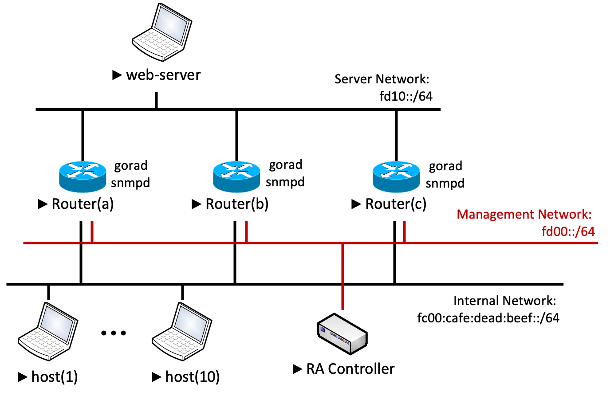

# Polaris Lab — Docker Compose デモ環境

評価・デモ用にすぐ起動できる、自己完結型の Polaris デプロイ環境です。
サイト出口ルータ 3 台、エンドホスト 10 台、コントローラ、上流 Web サーバを
`docker compose up` で起動できます。

[English](README.md) / [日本語](README_ja.md)

## トポロジー

IPv6 サイトマルチホーミング構成の 1 セグメントごとに Docker bridge
ネットワークを 1 つずつ用意した 3 セグメント構成です:



| セグメント | サブネット | メンバー |
|-----------|-----------|---------|
| `internal` | `fc00:cafe:dead:beef::/64` | host01..10、router1..3（RA 送信用）|
| `mgmt`     | `fd00::/64`                | controller、neighbor-collector、router1..3（gRPC）|
| `server`   | `fd10::/64`                | web-server、router1..3（上流転送）|

各ルータは 3 ネットワーク全てに接続されています。**内部セグメント側の
インターフェース名** は Docker の `eth0/eth1/eth2` 割り当て順が非決定的
であるため、プレフィクス（`fc00:cafe:dead:beef::/64`）から動的に検出します。

## クイックスタート

```bash
# リポジトリのルートで
git submodule update --init                # agent/go-ra を取得
docker compose -f laboratory/docker-compose.yaml up --build
```

全コンテナが healthy になったら（初回ビルド後 30 秒程度）:

1. <http://localhost:3000> を開く
2. `Router(a/b/c)` は起動時の自己登録によって既に登録済み
   （`entrypoint-agent.sh` が `POST /api/routers` をコール）
3. SNMP の初回ポーリング（〜30 秒）を待つと **Clients** タブに
   10 ホストが表示される
4. UI または CLI スクリプト（後述）でポリシーを適用

> **前提条件**: Docker daemon で IPv6 を有効化しておくこと。
> `/etc/docker/daemon.json` に
> `{"ipv6": true, "fixed-cidr-v6": "fd00:f::/64"}` を追加して
> Docker を再起動。

## デモ手順 — RIO ベースのポリシールーティング

このラボの検証スクリプトは **RIO ベース**（特定プレフィクス向け経路）の
制御のみを対象とします。

### ポリシー適用（ホストを 2 ルータに分配）

```bash
# Group 1: hosts 1-5  →  Router(a)  (RIO: fd10::/64)
sh laboratory/check/apply-policy.sh "Router(a)" 1-5

# Group 2: hosts 6-10 →  Router(b)
sh laboratory/check/apply-policy.sh "Router(b)" 6-10
```

インデックス `N` は `polaris-lab-hostNN-1` コンテナに対応します。
（例: `1-5` → host01〜host05、各コンテナの link-local を実行時に解決）

スクリプトは以下を実行します:
1. 指定されたインデックスから host01〜10 の link-local を解決
2. それらのホストで Group を作成
3. Rule を作成（`nexthop = router.address`、`entries = [{value: fd10::/64}]`）
4. Rule を Group に割り当て、`POST /api/policy/apply`
5. 5 秒待機後 `check-routing.sh` を実行

### 検証

```bash
sh laboratory/check/check-routing.sh
```

各ホストのルーティングテーブルを参照し、`fd10::/64` の RIO 経路の
`via` ネクストホップを表示します:

```
HOST        NEXT HOP (RIO route)
host01      fe80::abcd:...     ← Router(a) の link-local
host02      fe80::abcd:...     ← Router(a)
...
host06      fe80::ef01:...     ← Router(b)
```

`(no RIO route — not in any policy group)` は、ユニキャスト RA がまだ
到達していないか、そのホストがどの Group にも属していないことを意味します。

### CLI 使用法

```
sh laboratory/check/apply-policy.sh <router>  <hosts>

  <router>   "Router(a)" | "Router(b)" | "Router(c)"
             または IPv6 アドレス（例: fc00:cafe:dead:beef::ff01）
  <hosts>    "1-5"  範囲指定
             "1,3,5" リスト
             "all"  全ホスト
```

---

## デモ手順 — Web UI から

1. ダッシュボード上部の **Routers** カードに各ルータの到達性が表示される。
   インターフェース名（`eth0` / `eth1` / `eth2`）をクリックすると、
   現在動作中の RA 設定を確認できる
   （config #0 = baseline multicast、config #N≥1 = ユニキャストポリシー）。
2. **Clients** タブ — 検出されたホスト一覧（link-local、source router、
   state）。複数選択可能。
3. **Policy Groups** タブ — 選択したクライアントから Group を作成。
4. **RA Policy** タブ — Rule を作成（destination `fd10::/64`、
   nexthop `Router(a)`）。
5. Group に Rule を割り当てて **Apply** をクリック。
6. ルータの RA Interface モーダルを再表示すると config #1 に対象クライアント
   が含まれていることが確認できる。

---

## コンポーネント

| サービス | イメージソース | ポート | 役割 |
|---------|---------------|------|------|
| `web-server`         | `Dockerfile.webserver`           | 80 (内部) | nginx、ラボの "Internet" |
| `router1/2/3`        | `Dockerfile.agent`               | 50051 (gRPC)、161 (snmpd) | go-ra + snmpd、コントローラに自己登録 |
| `controller-backend` | `Dockerfile.backend`             | 8080 | Go HTTP API (chi router) |
| `controller-frontend`| `Dockerfile.frontend`            | 3000 → 80 | React ビルドを serve、`/api` を proxy |
| `neighbor-collector` | `Dockerfile.neighbor-collector`  | 8083 | 各ルータへの SNMP ポーリング (`ipNetToPhysicalTable`) |
| `host01..host10`     | `Dockerfile.host`                | —    | Alpine + `iputils` + `iproute2`、RIO 受信を有効化 |

### 自動検出のフロー

1. 各ルータが起動時と 25 秒間隔で `ff02::1` を ping し、内部セグメント上の
   全ホストでカーネル NDP キャッシュを生成。
2. `snmpd` が `ipNetToPhysicalTable`（RFC 4293 / OID `1.3.6.1.2.1.4.35`）
   経由で NDP キャッシュを公開。
3. `neighbor-collector` が 3 ルータを並列ポーリングし、結果をマージ:
   - ルータが `PUT /api/targets/{host}` で登録した内部インターフェース名で
     フィルタ
   - link-local アドレス（`fe80::/10`）のみ採用
4. `controller-backend` が collector を watch し、検出された neighbor を
   SQLite に永続化。

---

## RIO 受信の有効化（必須！）

Linux カーネルはデフォルトで RA 内の RIO を無視します
（`net.ipv6.conf.<iface>.accept_ra_rt_info_max_plen = 0`）。
ラボの各ホストはコンテナ起動時に Docker の `sysctls:` ディレクティブで
これを 128 に設定しています:

```yaml
sysctls:
  net.ipv6.conf.all.accept_ra_rt_info_max_plen: 128
  net.ipv6.conf.default.accept_ra_rt_info_max_plen: 128
```

これがないとユニキャスト RA は到達しても RIO エントリが silent drop され、
`ip -6 route show fd10::/64` は何も返しません。

---

## ファイル一覧

```
laboratory/
├── docker-compose.yaml          3 セグメント・17 サービスのトポロジー
├── Dockerfile.agent             go-ra + snmpd ビルダ (Alpine 3.21)
├── Dockerfile.backend           コントローラ backend (Go 1.24、SQLite で CGO)
├── Dockerfile.frontend          React ビルド + nginx
├── Dockerfile.host              最小 Alpine end-host
├── Dockerfile.neighbor-collector
├── Dockerfile.webserver         全ルータ経由の戻り経路を持つ nginx
├── entrypoint-agent.sh          IF 自動検出、snmpd、自己登録、定期 ND ping
├── entrypoint-host.sh           sysctls (RA / RIO 受信)
├── entrypoint-webserver.sh      fc00:cafe:dead:beef::/64 への 3 ルータ経由戻り経路追加
├── nginx.conf                   frontend SPA + /api proxy + Cache-Control
├── nginx-webserver.conf         上流 Web サーバの応答
└── check/
    ├── apply-policy.sh          group + rule の作成 + apply (RIO)
    └── check-routing.sh         各ホストの fd10::/64 RIO ネクストホップ表示
```

## トラブルシューティング

### ポリシー適用後もホストに `(no RIO route ...)` と表示される

- もう少し待つ。コントローラの `POST /api/policy/apply` は即座に RA を
  トリガするが、ホスト側の NDP 処理は数 RA インターバルかかる場合あり。
- `accept_ra_rt_info_max_plen` の確認:
  ```bash
  docker exec polaris-lab-host01-1 \
    sysctl net.ipv6.conf.all.accept_ra_rt_info_max_plen
  # → 128
  ```
- ルータが unicast 設定を push したか確認:
  ```bash
  curl -s http://172.20.2.2:8080/api/routers/<id>/interfaces | jq
  # → clients=[fe80::...]、routes=[{prefix: "fd10::/64", ...}] が見えるはず
  ```

### Neighbor 一覧が空

- SNMP の初回ポーリング（〜30 秒）を待つ。
- ログ確認: `docker logs polaris-lab-neighbor-collector-1 | tail`
- ルータの自己登録を確認:
  ```bash
  docker exec polaris-lab-controller-backend-1 \
    wget -qO- http://localhost:8080/api/routers
  ```
